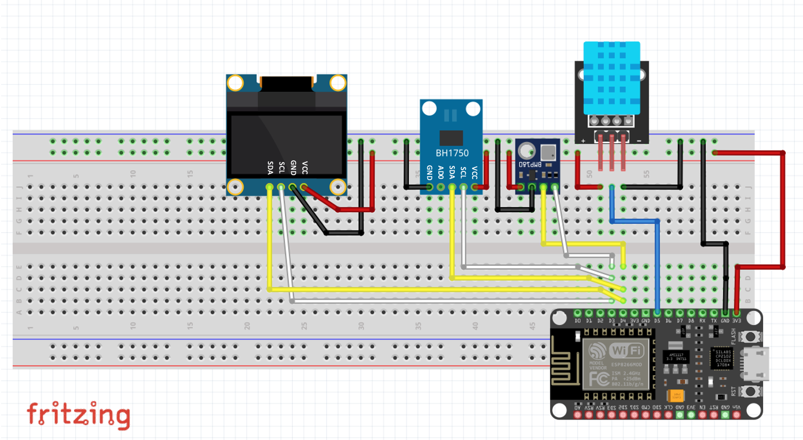

# Assembling the Generic ESP8266 Weather Kit

These kits require some soldering to put headers onto several of the
sensors. Once you've done that, you're ready to assemble.  Some kits
have a QR code pointing to an 
[IdeaSpark github repository](https://gitlab.com/GJKJ/WSK)
(the associated organization has a defunct webstore)
where there is a downloadable DOC file with instructions.
I do not recommend trying to follow it, though it has some nice images.

Note first that the ESP8266 processor board is too wide
to straddle the middle channel on the breadboards that
came in the kit, but you only need the pins on the right
side (when viewing the board with the USB interface
facing down and toward you).  That is, the side with pins
D0, D1....G, 3V.

There are a few helpful guides for wiring this up. The wiring pin
assignments below will work with the code here. 

### I2C and this Kit

The OLED and two of the sensors use 
[I2C](https://learn.sparkfun.com/tutorials/i2c/all).
The code here uses pins **D3** and **D4** for the I2C
SCL and SCA connections.
The *default* for the I2C libraries is to use *D1* and *D2* but
on the ESP8266 I was unable to make this work. In the code,
the command **Wire.begin();** is where you specify the ports,
and I tried allowing the default **Wire.begin()** call,
nor explicitly specifying the pins in as well as explicitly
assigning them via **Wire.begin(D1, D2);** to no avail.

So the guide below uses D3 and D4, with the corresponding call
(in *setup()*) **Wire.begin(D3, D4);**.

The downside of using D4 is that this is also the LED_BUILTIN pin,
so I'm not able to do any clever signaling with the LED..

(it could be that I have a hardware issue...lmk if you make it work
with default pins!).

### Wiring things up

Below are wiring instructions that specify the endpoints for each 
jumper wire on your breadboard.  You'll notice that the ESP board
is supplying power and ground to all of the other devices, and that
one sensor (DHT11, temperature and relative humidity) connects
to its own pin but the other two sensors and the OLED display
are all connected to common pins (D1/D2 or D3/D4). These devices
use I2C, so they share an input channel (among other benefits, 
reducing the number of pins needed on the processor board).

In the image you'll see I am using a breadboard with power/ground
buses and this is handy to make wiring a bit easier to follow,
but the breadboard supplied in your kit works just fine too.

*Tip: Some of the guides I've seen use random colors for wiring,
making their images nearly impossible to follow.  It's *well worth it*
to use a color scheme to make debugging or changing the wiring on
your breadboard easier.  Choose one color for power (red), another
for ground (black), then the same colors for the pairs of wires
coming from the 3 I2C devices and a unique collor for the signal
wire coming from the DT11.  (the actual colors don't matter, just
the consistency)*

In the image below I'm using Black=GND, Orange=VCC,
Yellow=SDA, White=SCL, and Blue=OUT on the DHT11.

* OLED (display)
	* SDA <----> D3
	* SCL <----> D4
	* VCC <----> 3V
	* GND <----> G
* BH1750 (light intensity)
	* SDA <----> D3
	* SCL <----> D4
	* VCC <----> 3V
	* GND <----> G
* BMP180 (atmospheric pressure, temperature, relative humidity)
	* SDA <----> D3
	* SCL <----> D4
	* VCC <----> 3V
	* GND <----> G
* DHT11 (temperature, relative humidity)
	* OUT <----> D5
	* VCC <----> 3V
	* GND <----> G

### Image of the wired-up breadboard

In the image I am using a breadboard with VCC and GND buses on each side.
The ESP8266 is plugged in only on one side as for these projects we don't 
need the pins on the other side of the board. VCC and GND from the 
ESP8266 are connected to the VCC and GND buses at top, and the board
is powered via USB.

### Fritzing diagram
The fritzing diagram below exactly matches the photograph above, including
the wire colors, where I 've used
black for GND, orange for VCC (yes, it is better to use red, so I did so in the
fritzing diagram)),
blue for OUT, yellow for SDA, and white for SCL.

Left to right at top are the
[0.96" OLED display](https://www.amazon.com/Diymall-Yellow-Arduino-Display-Raspberry/dp/B00O2LLT30?th=1),
[BH1750](https://www.instructables.com/BH1750-Digital-Light-Sensor/)
(light intensity), and
[BMP180](https://www.adafruit.com/product/1603)
(barometric pressure, temperature, altitude), all connected via I2C,
and the
[DHT11](https://components101.com/sensors/dht11-temperature-sensor)
(temperature, relative humidity), with output connected to pin D5.

Note that there are different versions of breakout boards that hold
these sensors, with differences in pin assignments. For instance, with
the more common version of the BH1750 the pins (left-to-right in the 
fritzing figure) are (ADDR-SDA-SCL-GND-VCC) whereas the one I am using
has assignments (GND-ADDR-SDA-SCL-VCC).
Consequently,
your wiring setup may differ slighly from the one shown here.
Check each of your sensor breakout pins to be sure they are
connected per the pin assignments shown in text above (XXX <---> PIN).

